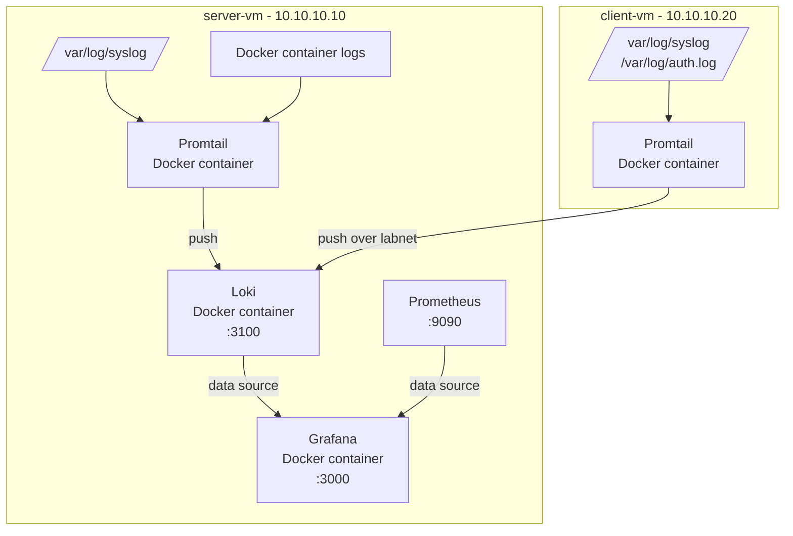

# Project 9: Centralized Logging with Loki + Promtail

Centralized log aggregation added to the existing Prometheus + Grafana monitoring stack (Project 5). Loki collects logs from both lab VMs via Promtail agents, queryable directly in Grafana alongside metrics.

## Architecture

## Components

| Component | Location | Role |
|---|---|---|
| Loki | server-vm (Docker) | Log aggregation and storage |
| Promtail (server) | server-vm (Docker) | Ships syslog + Docker container logs |
| Promtail (client) | client-vm (Docker) | Ships syslog + auth.log over `labnet` |
| Grafana | server-vm (Docker) | Unified query UI for logs (Loki) + metrics (Prometheus) |

## Key Decisions

- **Promtail via Docker on both VMs**, not native systemd. Grafana has deprecated the standalone Promtail binary in favor of Grafana Alloy, and recent Loki releases no longer ship the binary as a downloadable asset. The Docker image remains actively published, so containerizing was the reliable path for both hosts.
- **client-vm required a new Docker installation** to support this — previously Docker-free, matching its role as a lightweight client host.
- Loki configured with filesystem storage and a 7-day (168h) retention period, appropriate for a lab environment.
- `client-vm`'s Promtail pushes to Loki over the internal `labnet` network (`10.10.10.10:3100`), consistent with how `client-vm` reaches `server-vm` for other services in this lab.

## Issues Resolved

1. **YAML indentation break in `docker-compose.yml`** — pasting new service blocks via GitHub's web editor shifted indentation, causing a parser error (`did not find expected key`, line 83). Fixed by rewriting the `loki:` and `promtail:` blocks with explicit, consistent 2-space indentation matching existing services.
2. **Promtail binary download failures** — GitHub's `/releases/latest/download/` redirect and several pinned version tags (v3.6.12) returned 404s for `promtail-linux-amd64.zip`. Root cause: Promtail has been deprecated in favor of Grafana Alloy, and standalone binary distribution is being phased out. Resolved by running Promtail as a Docker container on both hosts instead.
3. **Grafana UI access from Windows host** — `http://10.10.10.10:3000` timed out when accessed from the Windows host browser, since `labnet` is an internal-only VirtualBox network with no route from the host. Resolved using the pre-existing NAT port-forwarding rule on `server-vm` (`localhost:3000` → guest `3000`).
4. **Loki data source added via API instead of UI** — with no confirmed GUI on `server-vm`, the Loki data source was registered in Grafana using a `curl` POST to `/api/datasources` with a JSON file, avoiding the need for browser-based clicking on that host.

## Verification

- `docker compose ps` on `server-vm` shows all 6 containers (`cadvisor`, `grafana`, `loki`, `node-exporter`, `prometheus`, `promtail`) running.
- Grafana Explore, querying `{job="syslog"}` and `{job="syslog", host="client-vm"}`, returns live log streams from both hosts with a log-volume histogram broken down by level.

## Next Steps

- Nginx SSL/TLS
- WireGuard VPN
- Active Directory on Windows Server
- Consider migrating Promtail to Grafana Alloy in a future project, since Alloy is the actively maintained successor and a more current skill to demonstrate.
