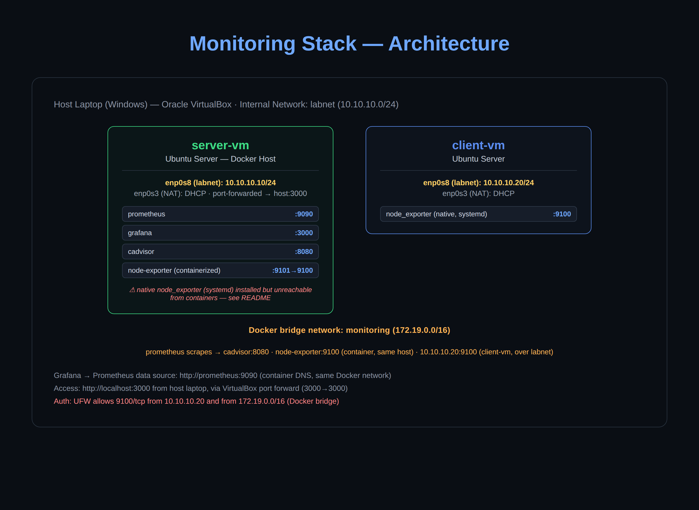

# Monitoring Stack with CI/CD Pipeline

## Network Topology

This project builds on the shared lab network topology established in
[linux-networking-lab](https://github.com/Landry5545/linux-networking-lab#network-topology).
`server-vm` and `client-vm` communicate over the internal `labnet`
network, with NAT adapters providing internet access independently on
each VM.



## CI/CD Pipeline (Project 6)

This project was extended with a self-hosted GitHub Actions runner on `server-vm`. Every push to `main` automatically redeploys the monitoring stack via Docker Compose. The runner runs as a systemd service and initiates an outbound connection to GitHub — no inbound SSH required, no ports exposed.

**CI/CD Flow:** Push to GitHub → runner pulls latest → `docker compose up -d --build`

---

A self-hosted monitoring stack for a two-VM lab environment, built on Docker Compose. Prometheus scrapes host and container metrics from both VMs; Grafana visualizes them. This is the fifth project in an ongoing IT infrastructure portfolio.

## What this monitors

| Target | Type | Method |
|---|---|---|
| `server-vm` host metrics | CPU, memory, disk, network | node_exporter (containerized) |
| `client-vm` host metrics | CPU, memory, disk, network | node_exporter (native, systemd) |
| Docker containers on `server-vm` | Per-container CPU/memory | cAdvisor |
| Prometheus itself | Scrape health, TSDB stats | self-scrape |

## Stack

- **Prometheus** — scrapes and stores time-series metrics (15s interval, 15-day retention)
- **Grafana** — dashboards and visualization
- **cAdvisor** — exposes per-container resource metrics
- **node_exporter** — exposes host-level OS metrics (one native install, one containerized — see below)

All four services other than the native node_exporter run via a single `docker-compose.yml` on `server-vm`, joined to a custom bridge network (`monitoring`).

## Setup

```bash
git clone <this-repo>
cd monitoring-stack
docker compose up -d
```

Edit `prometheus/prometheus.yml` to point at your own VM IPs before bringing the stack up — the file as committed uses this lab's addresses (`10.10.10.10`, `10.10.10.20`).

Grafana is reachable at `http://<server-vm-ip>:3000` (default login `admin` / set your own password on first login). Add Prometheus as a data source at `http://prometheus:9090` — use the container name, not `localhost`, since Grafana resolves it via Docker's internal DNS on the shared network.

Dashboards imported from Grafana.com:
- **1860** — Node Exporter Full (host metrics)
- **19908** — cAdvisor Docker Insights (container metrics)

## Architecture notes

- `server-vm` and `client-vm` communicate over a VirtualBox internal network (`labnet`, `10.10.10.0/24`) — reused from the earlier networking lab project.
- Grafana's port 3000 is reached from the host laptop via a VirtualBox NAT port-forward rule (host `3000` → guest `3000`), since `labnet` IPs aren't routable from outside VirtualBox.
- UFW on each VM explicitly allows port `9100/tcp` only from known sources (the other VM's IP, and — after the issue below — the Docker bridge subnet), rather than opening it broadly.

## The networking problem (and why node_exporter is split two ways)

This project's main lesson came from getting Prometheus to scrape `server-vm`'s own host metrics, and it's worth documenting in full because the failure mode wasn't obvious.

**The setup that should have worked:** node_exporter installed natively on `server-vm` via systemd, listening on `0.0.0.0:9100`. Prometheus running in a container on that same machine. The plan was to scrape it via whatever IP let the Prometheus container reach back out to its own host.

**What actually happened:** every host-side IP I tried failed with the same symptom — `context deadline exceeded` — as if nothing were listening, even though `curl` from the VM's own shell confirmed node_exporter was up and serving metrics correctly on each one:

1. `10.10.10.10` (the VM's real LAN IP on `labnet`) — timed out
2. `172.17.0.1` (Docker's default `docker0` bridge gateway) — timed out
3. `172.19.0.1` (the actual gateway of this project's custom `monitoring` bridge network) — timed out

Each of these is a different, more "correct" answer to "how does a container reach its host" — and all three failed identically. That consistency was the actual diagnostic signal: the problem wasn't which IP I picked, it was that **traffic from inside any Docker bridge network on this VM couldn't route back to a process on the host at all.**

I ruled out the usual suspects one at a time:
- UFW rules — confirmed correctly added and ordered (`sudo ufw status numbered`)
- Docker's own `DOCKER-USER` iptables chain — confirmed empty, no blocking rules
- IP forwarding — confirmed enabled (`net.ipv4.ip_forward = 1`)

With config, firewall, and kernel forwarding all ruled out, the most likely remaining explanation was a host/VirtualBox-NAT-specific quirk in how `iptables` `MASQUERADE` rules were (or weren't) interacting with the bridge — something I could have kept digging into, but decided wasn't worth the time for a lab environment.

**The fix:** stop trying to reach the host from inside a container, and run node_exporter *as* a container instead, on the same `monitoring` Docker network as Prometheus. Container-to-container traffic on a shared bridge network is unambiguous and was already proven to work. Mounting `/proc`, `/sys`, and `/` read-only into the node_exporter container (with `pid: host`) gives it visibility into the real host, not just its own container, so the metrics are identical to what the native install would have reported.

**Takeaway:** when several theoretically-correct fixes fail in exactly the same way, that's usually a sign the layer you're debugging isn't the one that's actually broken. Pivoting to a different architecture (containerize the exporter) cost less time than continuing to chase the routing issue, and is also just a legitimate, common pattern in real Docker monitoring setups.

## Repo structure
monitoring-stack/
├── docker-compose.yml
├── prometheus/
│   └── prometheus.yml
├── images/
│   └── architecture-diagram.png
└── README.md
